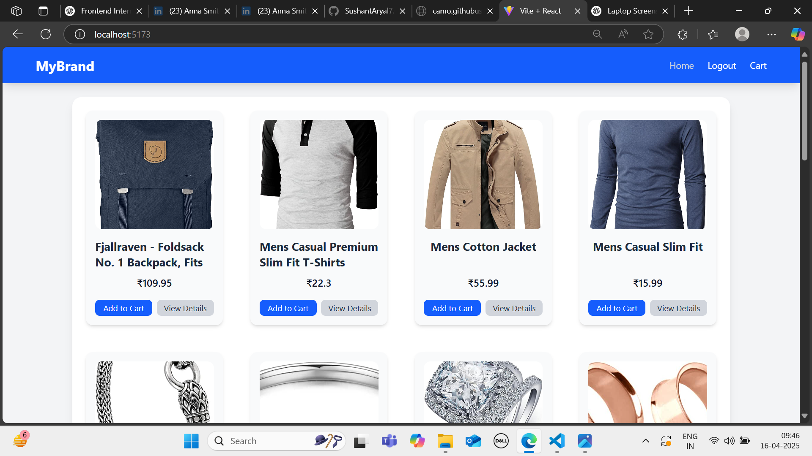
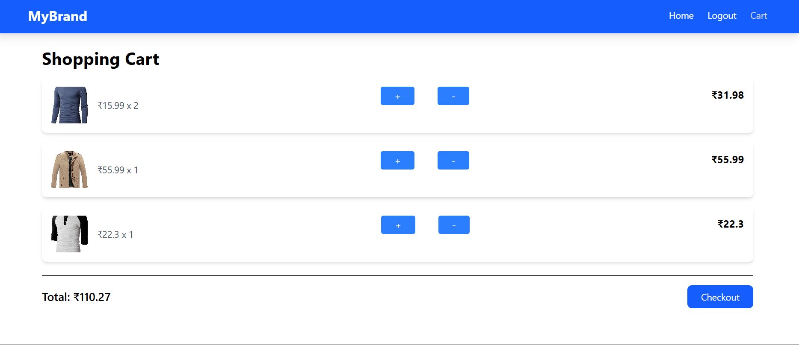

# 📌 E-commerce Web Application — React | Redux | Firebase | Local Storage

Developed a fully functional E-commerce web application where users can browse products and add them to their cart. The cart feature supports item quantity management and persists data using Local Storage for a seamless user experience.

Key Features:

🛒 Add to Cart / Remove from Cart functionality with real-time updates.

💾 Cart data is saved using Local Storage, ensuring persistence across sessions.

🔐 Firebase Integration for user authentication and backend support.

📦 Redux is used for global state management, especially for the cart and user state.

📱 Responsive UI for mobile and desktop screens.

Tech Stack: React, Redux, Firebase, Local Storage, CSS/Tailwind

## 🛠️ Technologies Used

- HTML5
- CSS3 / Tailwind 
- JavaScript / React
- Redux / Firebase / Local Storage

## 🚀 Features

- ✅ Feature 1 (e.g. User login with Google)
- ✅ Feature 2 (e.g. Add to Cart, Checkout)
- ✅ Feature 3 (e.g. Dark Mode)

## 📷 Screenshots

| Home Page | Cart Page |
|-----------|--------------|
|  |  |


## 📦 Installation

```bash
git clone https://github.com/yourusername/projectname.git
cd projectname
npm install
npm start
